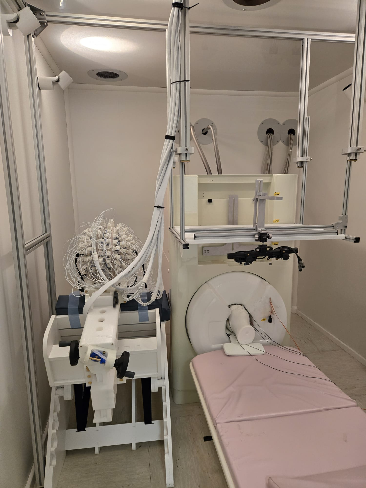

****************
MEG Lab Overview
****************

MEG Systems Overview
####################

MagnetoEncephaloGraphy (MEG) systems are machines capable of measuring the magnetic field generated by the brain.
They provide very high temporal resolution.
They are non-invasive, similar to a microphone listening to your voice, MEG measures the magnetic
field generated physiologically by the brain.

Unlike MRI, MEG cannot show the anatomical structure of the brain,
therefore MRI scans are combined with MEG measurements to identify the parts of the brain
responsible for the measured brain activity.
The Magnetically Shielded Room (MSR) is necessary to isolate the sensors from external magnetic field
and noise sources. The NYUAD MEG lab is equipped with a MSR from Vacuumschmelze (Hanau, Germany).
The shielding effect is provided by two layers of mu metal; the inner layer is 3 mm and the outer layer is 2 mm thick.
Predicted shielding performance was rated to be -60 dB at 1 Hz; actual performance exceeds this prediction.
The exterior dimensions of the room are 2.9 x 3.5 x 2.9 m, and the inner dimensions are 2.4 x 3.0 x 2.4 m.
The NYUAD MEG lab has two MEG systems:

- MEG-KIT system that has SQUID gradiometer sensors from Kanazawa Institute of Technology (Japan)
- MEG-OPM system that uses optically pumped magnetometers from Fieldline (USA)