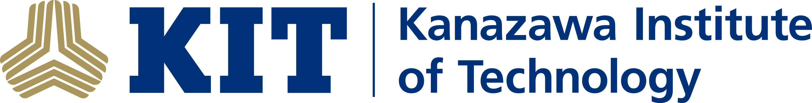

.. _kit_nyuad_meg:

**************
Collaborations
**************

KIT & NYUAD Collaboration
-------------------------

.. figure:: ../graphic/NYU_Logo.png
   :width: 45%
   :align: right

The **Kanazawa Institute of Technology (KIT), Japan**, and **New York University Abu Dhabi (NYUAD)** have an ongoing collaboration
since 2012 to advance **magnetoencephalography (MEG) research**. KIT installed the **MEG SQUID system** at NYUAD,
supporting research, system maintenance, and training for NYUAD personnel.

With NYUAD’s newly acquired **Optically Pumped Magnetometer (OPM) system**, the partnership continues to drive innovation in MEG studies comparing the two technologies.
