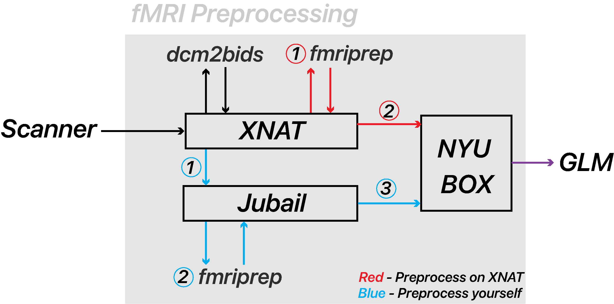

Generic pipeline
================

Author: Hadi Zaaiti <hadi.zaatiti@nyu.edu>, Puti Wen <puti.wen@nyu.edu>

.. contents:: Table of Contents
   :depth: 3
   :local:

Different modalities for processing EEG-fMRI data exists in the literature:

- assymetrical approach where one modality (EEG or fMRI) constrains the other modality
    - mainly the EEG data constrains temporally the fMRI data
    - or the fMRI data constrains spatially the EEG data
- symetrical approach where both modalities constrain each other

The assymetrical approach seems more popular in the literature.

Required Data
-------------

- fMRI data consists of
    - times series of Bold signals mapped to a geometric space (either to each voxel, or to vertices of a surface)
- EEG data consists of
    - A .eeg file: raw data from the electrodes (time series)
    - A .vhdr or .xhdr file: a header containing metadata on parameters and sensors, layout of coordinates of sensors
    - A .xmrk file: contains markers with their time (can be opened in a text file)
- for source reconstruction
    - EEG/FMRI requires a T1 image (the subject should not have the EEG cap while getting the T1)

Example of such datasets are present on NYU-BOX.
Demo dataset has been provided by BP and are available on the recording computer:

The generic pipeline for EEG-fMRI data processing involves the following steps, detailed below

.. contents:: Table of Contents
   :local:
   :depth: 2

.. admonition:: References

    1. Cilia Jaeger (2024). *BP Academy Webinar Recording: Combined EEG and fMRI data analysis*.
        - Youtube webinar available at `https://www.youtube.com/watch?v=vGQVeCn53ys <https://www.youtube.com/watch?v=vGQVeCn53ys>`_
        - EEG-fMRI Data preprocessing and considerations - Session 2: https://youtu.be/5EqyURlZDMA?feature=shared
        - Combining EEG and fMRI data analysis – Session 3: https://youtu.be/vGQVeCn53ys?feature=shared

Preprocessing of the EEG data
-----------------------------

Preprocessing of the EEG data involves multiple step. We will be using BrainVision Analyzer. Plug the BrainVision dongle onto any windows comptuer you will be using it for the Analysis.

- Open BrainVision Analyzer

- Create three folders in a directory, name them as follow
    - export: this will contain exported data from analysis pipeline
    - history: this will contain all processing steps
    - raw: put your raw .eeg, .vhdr, .vmrk here

EEG data triggers
~~~~~~~~~~~~~~~~~

The EEG data from an EEG/fMRI experiment should have the following trigger signals

- `Sync On` of marker type `Sync Status` is a marker repeated every period of time ensuring that the MRI clock and EEG system are in sync
- `T 1_off` of marker type `Toggle` is a marker

    .. figure:: 0-generic-pipeline-figures/fig1.png
       :align: center
       :alt: Description of the image
       :width: 50%

       One TR (repetition time) corresponds to T 1_off - T 1_on.

ECG Removal
~~~~~~~~~~~

- The subtraction method can work better than ICA, use the substraction method to remove ECG signals

Steps for noise removal and pre-processing
~~~~~~~~~~~~~~~~~~~~~~~~~~~~~~~~~~~~~~~~~~

- Gradient artifact correction:
    - Always remove the gradient artifacts first.
    - ECG with gradient artifacts can be saturated sometimes, which means that the ECG sensor should be moved around.
    - MRI artifact correction: then pick use markers, then R128, making sure the correction is only during these triggers and not for the rest.
    - Then Next.
    - Artifact Type is always **Continuous** (interleaved was an old thing when MRI was collected for a period of time and then EEG for another period of time).
    - Enable **Baseline correction for average** (compute baseline over the whole artifact).
    - Use **sliding average calculation** to account for changes in gradient artifacts over time.
    - Do not select **Common use of all channels** for bad intervals and correlation.
    - Then next: select all EEG channels (only time we don’t use all channels is if we are measuring a specific thing).
    - Then next: deselect downsampling (we can do this later).
    - How to store data Select **store corrected data** in a cached file.
- ECG signals correction after gradient artifact cleaning:
    - Also use a **sliding average subtraction** approach (Not ICA), use ICA if there is a residual.
    - We do not have markers on the peaks (this is needed for the subtraction method).
    - We need to add **R peaks** (peaks on the ECG signals).
    - After the gradient artifact correction, some high-frequency noise stays in the ECG channel during MRI acquisition.
    - Apply **High Cutoff Frequency**: go to **Transformations**, then **IIR filter**, disable the Low cutoff and High cutoff of all channels, then select only the ECG channel and apply a high cutoff (15 Hz), then apply filter.
    - Then **Transformations**, **Special Signal Processing**, then **CB correction**.
    - Choose the **ECG channel** (if it's a clear heartbeat, if not use another EEG channel that shows a clearer one than ECG).
    - Go through the manual check if the automatic analyzer skipped some R peaks.
    - After selecting all the R peaks (which should be marked in Green), click **Finish**.
    - Then the R peaks should appear on the peaks as R.
    - Go to **Special Signal Processing**, select **CB**, then select **Use Markers**, then select **R markers**.
    - Then next, and use the whole data to compute the time delay. The total number of pulses is the sliding signal window. Empirically, we use 21 as the parameters.
    - Select all EEG channels except for CWL and the ECG channel.
- Carbon Wired Loops (CWL), accounts for movement correction:
    - Change sampling rate: we need to downsample and then apply the **CWL regression**.

We can automate the process by saving all the analysis steps.

Helium Pump Noise:
~~~~~~~~~~~~~~~~~~
- Components around the 50Hz frequency should appear in all channels.
- The helium pumps cannot be turned off during an experiment.

Pre-processing steps should involve:
~~~~~~~~~~~~~~~~~~~~~~~~~~~~~~~~~~~~
1. Inspecting the static field data.
2. Gradient-artifact correction.
3. ECG correction or CWL regression (Cardioballistic artifacts).
4. Classic EEG analysis.

Pre-processing of the fMRI data
-------------------------------

   Figure 1: Overview of the fMRI Pre-processing Steps 
   (Red: Run on XNAT, Blue: Run Locally)

Overview
~~~~~~~~

- We store and organize raw scanner data in **XNAT**.
- We convert these data to BIDS format using **dcm2bids**.
- We perform standardized preprocessing with **fMRIPrep**.
- We rely on **NYU Box**, **Jubail HPC**, and **XNAT** for secure data transfer, computation, and storage.

Together, these tools produce reproducible, GLM-ready fMRI outputs.

Converting DICOM to BIDS on XNAT
~~~~~~~~~~~~~~~~~~~~~~~~~~~~~~~~

- Prerequisites for Running **dcm2bids**
    #. Ensure your DICOM data are properly uploaded to your **xnat** project.
    #. Confirm you have an active **xnat** account with the necessary access permissions.
- Running **dcm2bids**
    #. Navigate to your **xnat** project.
    #. Prepare a **dcm2bids** configuration JSON file containing all required scan-to-BIDS mappings, and store it on **xnat**.
        - example config file can be found in `pipeline/eeg_fmri_pipelines/fmri_preprocessing\utilities` together with a batch script to help run `dicom2bids` command
        - Click on your project, then `Manage Files`, select `resources` for `level` then add Folder called `configs` then upload file `config.json`
    #. Select the **Processing Dashboard**, and then **MR Sessions**

        .. figure:: 0-generic-pipeline-figures/f2.png
            :alt: Schematic of the fMRI Preprocessing Pipeline
            :align: center
            :figclass: align-center

    #. Under **Select elements to launch processing**, in dropdown menu **Select Job**, select **dcm2bids-session**
    #. Select Subjects you want to process, and click **Launch job**
    #. Click **Reload** to see the job status and wait for it to finish (this may take a 5-15 minutes)
    #. Sanity check after running *dcm2bids*
        - After running `dicom2bids`, we want to verify the file structure:
            1. Ensure the expected folders are present:
               - `Func/`
               - `Eeg/`
               - `Anat/`
               - `Fmap/`
            2. Check filenames and parameters.
        - Ideally, each task has its own **sbref** (two files: one **AP**, one **PA**)
        - Similarly, **fmap** should have **AP** and **PA** (not for every run, but for every task)

Converting DICOM to BIDS on local computer
~~~~~~~~~~~~~~~~~~~~~~~~~~~~~~~~~~~~~~~~~~

- Install `dicom2bids` and `dicom2niix`
- Download your session from `XNAT`
- Adapt the `config.json` to your project
- Ensure an anatomical T1 is in your DICOM directory
- Run `dicom2bids_config_script.bat` to generate the BIDS output
    - Customize the batch script to put the correct subject ID and XNAT downloaded directory
- Run post_conversion.bat (this will replicate SBref AP and PA for each bold run)
    - Customize the batch script to provide your BIDS output directory
- Run BIDS validator online on your BIDS directory to make sure there are no errors

fMRI Preprocessing with fMRIPrep: Two Available Routes
~~~~~~~~~~~~~~~~~~~~~~~~~~~~~~~~~~~~~~~~~~~~~~~~~~~~~~

- Route 1 (Red Path): Running fMRIPrep on XNAT
    1. Running fMRIPrep on XNAT
        - In dropdown menu **Select Job**, select **bids-fmriprep-session-jubail**
        - Select the Subjects you want to process, and click **Launch job**
        - Click **Reload** to see the job status and wait for it to finish (this may take a 4-8 hrs)
    2. Returning fMRIPrep outputs from XNATto NYU BOX
- Route 2 (Blue Path): Running fMRIPrep Locally
    1. Downloading data from XNAT to Jubail
    2. Running fMRIPrep on Jubail
        a. Download the fMRIPrep image on Jubail
        b. Prepare the sbatch script
        c. Submit the sbatch script
    3. Returning fMRIPrep outputs to NYU BOX
    
        .. code-block:: bash

          rsync -av [YourNetID]@jubail.abudhabi.nyu.edu:/scratch/MRI/[YourProjectName]/ /local/path/to/NYUBOX/[YourProjectName]/

Route 2 fMRIPrep locally (on HPC Jubail)
~~~~~~~~~~~~~~~~~~~~~~~~~~~~~~~~~~~~~~~~

Once the BIDS directory is created then you can install fMRIprep on jubail, copy your BIDS data directory to Jubail then process your data.

Two scripts can be found under `pipeline/eeg_fmri_pipelines/fmri_preprocessing/utilities`:
- `get_fmriprep_image.sh`  run this script to pull the fMRIprep image and extract it
- '

GLM
~~~

- Load data in MATLAB
- Build the design matrix
- Run the GLM
- Save the GLM outputs
- Visually inspect GLM outputs in freeview

Troubleshooting
~~~~~~~~~~~~~~~

Other possible processing steps
~~~~~~~~~~~~~~~~~~~~~~~~~~~~~~~

These processing steps can enhance your processing pipelines depending on your paradigm.

- Draining vein effect correction (linear offset or CBV scaling or spatial deconvolution)
- Vascular Space Occupancy combined with EEG
- Nordic denoising, with time there is more heating that causes higher amplitudes so this requires denoising

Preparation of the forward/head model
-------------------------------------

Perform fMRI-informed EEG source reconstruction
-----------------------------------------------

- Coregistration requires computing the transformation, use the “layout” file that should help you match the electrodes with the headface
- Some technique uses the ultrasound protocol to locate the electrode and get a geometrical representation of the electrodes

Other methods
-------------

- Typical fMRI uses the GLM fitting, with EEG data it is possible to add regressors
    - Proposed method is to take the variability of the EEG data and inject that as regressor into the GLM (variability can be each trial variability or spectral feature such as correlation with a band, or temporal feature ERP peak … this will depend on your paradigm)
    - The non-stimulus activity can be used to correlate baselines (from eeg and fmri) together

Resources and Training Materials
================================

Manuals and Support Teams
-------------------------

Manuals
~~~~~~~
Manuals can be downloaded from the website: `Brain Products Manuals <https://www.brainproducts.com/downloads/manuals/>`_

Technical Support
~~~~~~~~~~~~~~~~~
- **Email:** techsup@brainproducts.com
- For questions about hardware, recording software, and MR-related artifact handling in Analyzer 2

Analyzer Support
~~~~~~~~~~~~~~~~~
- **Email:** support@brainproducts.com
- For questions about using Analyzer 2

Support Tips
------------

- **Recorder workspace settings for EEG-fMRI:** `Recorder setup EEG-fMRI <https://pressrelease.brainproducts.com/recorder-setup-eeg-fmri>`_

- **Best practices:** `EEG-fMRI Best Practices <https://pressrelease.brainproducts.com/eeg-fmri/>`_

- **Peripheral physiology measurements using BrainAmp ExG MR:**
  - Part 1: Let’s focus on EMG: `EMG-fMRI Guide <https://pressrelease.brainproducts.com/emg-fmri/>`_
  - Part 2: Let’s focus on ECG: `ECG-fMRI Guide <https://pressrelease.brainproducts.com/ecg-fmri>`_

Webinars
--------

Webinar Channels
~~~~~~~~~~~~~~~~
- `Brain Products Webinar Channel <https://www.gotostage.com/channel/brainproducts>`_
- `Brain Products Academy Channel <https://www.gotostage.com/channel/brainproductsacademy>`_

Analyzer Webinars
~~~~~~~~~~~~~~~~~
- **Introduction to Analyzer 2 & EEG analysis concepts:** `Watch webinar Analyzer 2 EEG <https://www.gotostage.com/channel/a26a09b972b84c52a391a16dfb4298e9/recording/599a9c6a758f4f68b8658fa93f8208fc/watch?source=CHANNEL>`_
- **EEG artifact types and handling strategies in BrainVision Analyzer 2:** `Watch webinar Artifact Type EEG <https://www.gotostage.com/channel/a26a09b972b84c52a391a16dfb4298e9/recording/d1ec7d100c124d0bb239b878cc213fcc/watch?source=CHANNEL>`_

EEG-fMRI Webinars
~~~~~~~~~~~~~~~~~~

- **Joint EEG-fMRI data analysis**
  - **Session 1: Introduction to EEG-fMRI:** `Watch on YouTube <https://youtu.be/TIuLOQ-jXko?feature=shared>`_
  - **Session 2: EEG-fMRI Data preprocessing and considerations:** `Watch on YouTube Preprocessing <https://youtu.be/5EqyURlZDMA?feature=shared>`_
  - **Session 3: Combining EEG and fMRI data analysis:** `Watch on YouTube Comining EEG/fMRI <https://youtu.be/vGQVeCn53ys?feature=shared>`_
- **Handling scanner-related artifacts:** `Watch webinar artifacts <https://www.gotostage.com/channel/a26a09b972b84c52a391a16dfb4298e9/recording/78c7a1aed89d4cdd96927a52e7227643/watch?source=CHANNEL>`_
- **CWLs:** `Watch webinar CWLs <https://www.gotostage.com/channel/a26a09b972b84c52a391a16dfb4298e9/recording/c06cc5a80c734c1abf67f37fca201e4f/watch?source=CHANNEL>`_
- **Getting ready for simultaneous EEG-fMRI: Safety and setup basics:** `Watch webinar Basic Setup <https://www.gotostage.com/channel/cd0cf85ada364ca2a41a06d9fcdd753b/recording/b1d94f4369764d95b07dca3f25c38a53/watch?source=CHANNEL>`_

Keep Up to Date
---------------

Sign up for the newsletter to receive information on events, support tips, and new products:
`Subscribe here <https://brainproducts.us18.list-manage.com/subscribe?u=38c01a4578a70ce90ffb717c9&id=fa9f4309e4>`_
