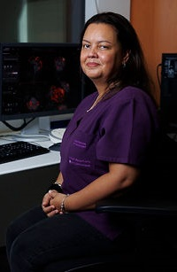
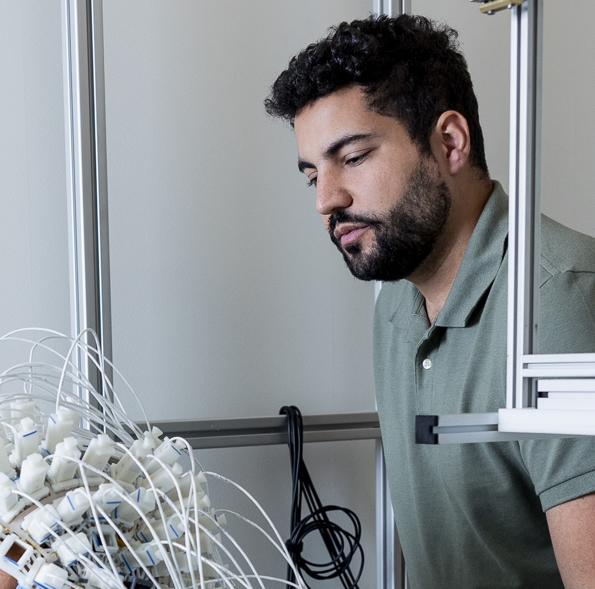
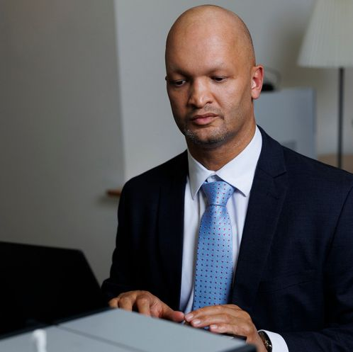

###################################################
NeuroWaves: MEG/EEG Lab at NYUAD documentation page
###################################################

.. include:: ../../README.rst

****
Team
****

Haidee Paterson
---------------

**MRI Instrumentation Specialist**

Haidee is an MRI radiographer with 25 years of experience, primarily in clinical MRI practice.
Over the past 7 years, she has specialized as a research instrumentation specialist,
leveraging her extensive experience to advance MRI research.
Her focus is on supporting research projects in three distinct areas:
MRI data acquisition, MRI integrated with EEG, and MEG data acquisition.

`haidee.paterson@nyu.edu <mailto:haidee.paterson@nyu.edu>`_

.. raw:: html

   

Hadi Zaatiti
------------

**MEG Research Scientist I**

Hadi is an MEG Research Scientist, specialized in MEG-EEG data processing,
with a background in designing embedded systems, representation learning and electrical engineering.
His main role is to support MEG-EEG projects by ensuring correct operation of the systems and processing of acquired data.

`hadi.zaatiti@nyu.edu <mailto:hadi.zaatiti@nyu.edu>`_

.. raw:: html

   

Osama Abdullah
---------------

**MRI Physicist II**

Osama is a research scientist and physicist who manages the daily operations of the BioMedical Imaging Core
at New York University Abu Dhabi, overseeing a research-dedicated 3-Tesla Siemens MRI scanner,
the MEG lab, and the Small Animal Imaging lab on campus.
In his role, he supports research activities and advances technical capabilities by
supervising researchers and technical staff and providing scientific assistance.

`osama.abdullah@nyu.edu <mailto:osama.abdullah@nyu.edu>`_

.. raw:: html

   

Lab Address
-----------

.. admonition:: Lab Address

   📍 **NeuroWaves Research Lab**
   A2, 008, Ground Floor,
   New York University,
   Abu Dhabi, Saadiyat Island

.. admonition:: Contact

   📧 Email: nyuad.meg@nyu.edu
   ☎ Phone: +971 02 556 8066

*********************************
Status of the documentation build
*********************************

.. image:: https://readthedocs.org/projects/neurowaves/badge/?version=latest
  :target: https://example-sphinx-basic.readthedocs.io/en/latest/?badge=latest
  :alt: Documentation Status

Download latest documentation from : `Download PDF <https://neurowaves.readthedocs.io/_/downloads/en/latest/pdf/>`_

Download the latest lab documentation and lab manual from `Release v-report-docs <https://github.com/BioMedicalImaging-Core-NYUAD/neurowaves-lab-documentation/releases/tag/v-report-docs/>`_

- `MEG Lab documentation PDF download <https://github.com/BioMedicalImaging-Core-NYUAD/neurowaves-lab-documentation/releases/download/v-report-docs/meg-lab-documentation.pdf>`_
- `MEG Lab manual PDF download <https://github.com/BioMedicalImaging-Core-NYUAD/neurowaves-lab-documentation/releases/download/v-report-docs/meg-lab-manual.pdf>`_

.. note::

   This project is under active development.

.. raw:: html

   <model-viewer src="graphic/3D-models/brain.glb" alt="3D Model"
                 auto-rotate camera-controls style="width: 100%; height: 500px;">
   </model-viewer>

*********************
Documentation content
*********************

.. toctree::
   :maxdepth: 2
   :caption: Lab Overview

   1-systems/0-meg-lab-overview
   1-systems/1-meg-kit-system
   1-systems/2-meg-opm-system
   1-systems/3-eeg-system
   1-systems/4-eeg-fmri
   1-systems/5-team
   1-systems/6-collaboration
   1-systems/quizz

.. toctree::
   :maxdepth: 2
   :caption: Performance Dashboards

   9-dashboard/1-systems-dashboard
   9-dashboard/2-data-quality-dashboards
   9-dashboard/3-documentation-dashboards

.. toctree::
   :maxdepth: 2
   :caption: Operation Protocol

   2-operationprotocol/training_meg
   2-operationprotocol/kit-operationalprotocol
   2-operationprotocol/opm-operationalprotocol
   2-operationprotocol/eeg-fmri-protocol

.. toctree::
   :maxdepth: 2
   :caption: Experiments Design

   3-experimentdesign/process-new-user
   3-experimentdesign/experimentdesign
   3-experimentdesign/experimentdesign-eeg-fmri
   3-experimentdesign/requirements
   3-experimentdesign/exampleexperiments

.. toctree::
   :maxdepth: 2
   :caption: Booking and usage

   2-operationprotocol/bookingsystem

.. toctree::
   :maxdepth: 2
   :caption: Data storage and naming

   4-data/1-datafiles.rst
   4-data/2-datastorage.rst

.. toctree::
   :maxdepth: 2
   :caption: Processing pipelines

   5-pipeline/4-0-pipelines
   5-pipeline/4-eeg-fmri-pipelines
   5-pipeline/5-notebooks

.. toctree::
   :maxdepth: 2
   :caption: Maintenance

   6-maintenance/maintenance

.. toctree::
   :maxdepth: 2
   :caption: Emergency and Risk Asessment

   7-emergency/emergency

.. toctree::
   :maxdepth: 2
   :caption: Contributing to this repository

   8-contributing/contributing

.. toctree::
   :maxdepth: 2
   :caption: Glossary and API

   glossary
   api
